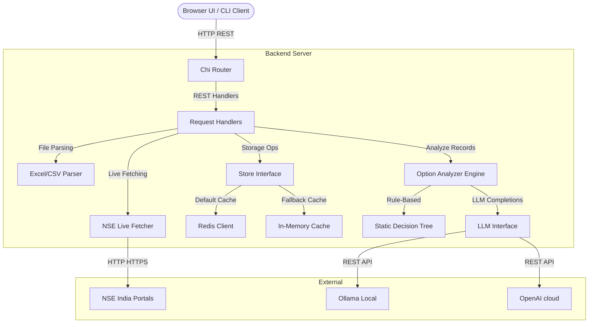

# OI Assistant: High-Level (HLD) & Low-Level (LLD) Design Documentation

This document describes the architectural layout, subsystem designs, interface contracts, and core algorithmic details of the **OI Assistant** project.

---

## 🏛️ High-Level Design (HLD)

### 1. System Architecture Diagram
The system follows a lightweight, local-first micro-architecture utilizing Go for the backend APIs, a Single-Page Application (SPA) frontend, and a pluggable cache engine.



### 2. Core Subsystems

* **Frontend UI Subsystem**: Built as a responsive Single Page Application (SPA) using vanilla HTML5, CSS3, TailwindCSS, and Chart.js. Communicates asynchronously with the backend server via `fetch` API endpoints. Provides drag-and-drop file inputs, a tabbed data layout, and two separate data visualization panels.
* **REST Routing & Gateway Subsystem**: Powered by the Go package `github.com/go-chi/chi/v5`. Manages server lifecycles, HTTP middleware (throttling, request IDs, timeouts, panic recovery), and maps server routes to their target handlers.
* **Data Parsing Subsystem**: Supports binary Excel spreadsheets (`.xlsx`/`.xls`) and comma-separated values (`.csv`) formatted in either tall (normalized) or wide (columnar option chain) layouts.
* **NSE API Fetcher Subsystem**: An internal client that mimics modern web browsers (headers, user-agents) and maintains persistent cookies to bypass bot protection rules and download live option chain indexes/equities directly from NSE India.
* **Storage & Cache Layer**: Pluggable storage layer using Go interfaces. Leverages a local Redis instance for persistent caching of processed option records, spot prices, and analyses. Seamlessly redirects cache traffic to a thread-safe local map cache if Redis is down.
* **Option Analysis Engine**: Computes derivatives indicators (PCR, IV Skew, Max Pain) and processes significant Open Interest change records. Uses a concurrent pipeline with a semaphore wrapper to complete LLM analysis prompts or falls back to rule-based option writing analytics.

---

## 🛠️ Low-Level Design (LLD)

### 1. Project Package Structure
The code complies with standard Go layout practices:
```
cmd/server/
  └─ main.go                 # System initialization, config loading, graceful shutdown
internal/
  ├─ api/
  │   ├─ handlers/
  │   │   ├─ handler.go      # Upload, Analyse, FetchNSE, AIReport handlers
  │   │   └─ parser_test.go  # Parser and symbol inference testing
  │   └─ routes.go           # REST endpoints registration
  ├─ core/
  │   ├─ analyzer.go         # Core Option Analysis Engine & rule fallbacks
  │   └─ analyzer_test.go    # Test cases for rules and mock LLMs
  ├─ excel/
  │   └─ parser.go           # Excel-specific mapping & row parser
  ├─ llm/
  │   └─ client.go           # Abstract LLM client (Ollama/OpenAI)
  ├─ models/
  │   ├─ config.go           # YAML configurations mapper
  │   └─ option.go           # Shared entities (OptionRecord, TradeSignal, AnalyseResponse)
  ├─ nse/
  │   └─ fetcher.go          # Cookie-jar live NSE data scraper
  └─ storage/
      ├─ store.go            # Unified Storage Contract (Store interface)
      ├─ redis_client.go     # Redis-backed client
      ├─ inmemory.go         # Thread-safe in-memory map cache fallback
      └─ inmemory_test.go    # Test cases verifying cache invalidation/TTL
```

### 2. Core Entities (Models)

The core data structures defined in internal/models/option.go are:

```go
type OptionRecord struct {
	Symbol      string  `json:"symbol"`
	StrikePrice float64 `json:"strike_price"`
	OptionType  string  `json:"option_type"` // "CE" or "PE"
	Expiry      string  `json:"expiry"`
	OI          int64   `json:"oi"`
	PrevOI      int64   `json:"prev_oi"`
	OIChange    float64 `json:"oi_change_pct"` // computed
	Volume      int64   `json:"volume"`
	LTP         float64 `json:"ltp"`
	IV          float64 `json:"iv"`
}

type OIMetrics struct {
	Expiry       string    `json:"expiry,omitempty"`
	PCR          float64   `json:"pcr"`
	MaxPain      float64   `json:"max_pain"`
	IVSkew       float64   `json:"iv_skew"`
	Bias         string    `json:"bias"`
	BiasReason   string    `json:"bias_reason"`
	TopCEStrikes []float64 `json:"top_ce_strikes"`
	TopPEStrikes []float64 `json:"top_pe_strikes"`
	TotalCEOI    int64     `json:"total_ce_oi"`
	TotalPEOI    int64     `json:"total_pe_oi"`
}

type TradeSignal struct {
	Symbol      string  `json:"symbol"`
	StrikePrice float64 `json:"strike_price"`
	OptionType  string  `json:"option_type"`
	Expiry      string  `json:"expiry"`
	Action      string  `json:"action"`     // BUY / SELL / WATCH
	Rationale   string  `json:"rationale"`
	Confidence  string  `json:"confidence"` // HIGH / MEDIUM / LOW
	Source      string  `json:"source"`     // "llm" or "fallback"
}
```

### 3. Interface Design

#### A. Storage Interface (internal/storage/store.go)
Allows pluggable swapping of backends. Both `RedisStore` and `InMemoryStore` implement this.
```go
type Store interface {
	SaveRecords(ctx context.Context, symbol string, records []models.OptionRecord) error
	GetRecords(ctx context.Context, symbol string) ([]models.OptionRecord, error)
	SaveSpotPrice(ctx context.Context, symbol string, price float64) error
	GetSpotPrice(ctx context.Context, symbol string) (float64, error)
	SaveAnalysis(ctx context.Context, symbol string, resp *models.AnalyseResponse) error
	GetAnalysis(ctx context.Context, symbol string) (*models.AnalyseResponse, error)
	DeleteSignals(ctx context.Context, symbol string) error
	Close() error
}
```

#### B. LLM Client Interface (internal/llm/client.go)
Abstractions for executing text completions across local and cloud providers:
```go
type Client interface {
	Complete(ctx context.Context, prompt string) (string, error)
}
```

---

### 4. Key Algorithms

#### A. Max Pain Strike Search
The Max Pain strike price is determined by iterating over all available strike prices and calculating the theoretical loss option sellers would incur if the underlying spot price expired at that strike. The strike price that minimizes seller loss is flagged as Max Pain.

$$\text{Loss}(S) = \sum_{K < S} (S - K) \times \text{OI}_{CE}(K) + \sum_{K > S} (K - S) \times \text{OI}_{PE}(K)$$

*Algorithm implementation from internal/core/analyzer.go:*
```go
var maxPain float64
minLoss := math.MaxFloat64
for _, s := range strikes {
    var loss float64
    for _, k := range strikes {
        if s > k {
            loss += (s - k) * float64(ceOI[k])
        }
        if k > s {
            loss += (k - s) * float64(peOI[k])
        }
    }
    if loss < minLoss {
        minLoss = loss
        maxPain = s
    }
}
```

#### B. Rule-Based Fallback Engine
When no LLM configuration is supplied (or rate limits are reached), option writing rules evaluate high-OI changes ($>20\%$ threshold) to yield deterministic trade actions:
* **PE Writing Build-up ($>50\%$ change)**: `BUY` (bullish support building at strike).
* **PE Unwinding ($<-30\%$ change)**: `SELL` (long cover, support breaking, bearish).
* **CE Writing Build-up ($>50\%$ change)**: `WATCH` (resistance building at strike).
* **CE Unwinding ($<-30\%$ change)**: `WATCH` (call shorts cover, potential breakout).

---

### 5. Caching and Storage Schema
Both Redis and In-Memory caches implement a unified key layout with a default Time-To-Live (TTL) of **24 hours**:

| Storage Key Pattern | Value Type | Description |
| :--- | :--- | :--- |
| `oi:records:{SYMBOL}` | `JSON String` | Array of parsed `models.OptionRecord` structs |
| `oi:spot:{SYMBOL}` | `Float64` | Current spot price of the underlying ticker |
| `oi:analysis:{SYMBOL}` | `JSON String` | Cached `models.AnalyseResponse` including computed metrics, signals, and generated AI commentary |
